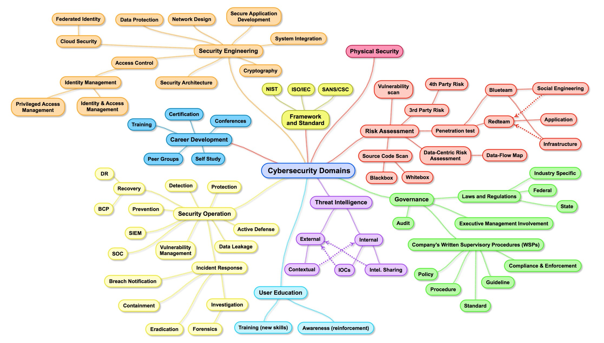

# CyberSecurity   

In recent years cybersecurity is the buzz word that we hear every other day through some or the other means. There is a drastic increase in the opportunities as well as the people interested in this field. But the problem that many of them face is that they do not have a complete picture of what “CYBERSECURITY” actually is and how they could be the right fit. There are always people asking or googling around regarding cybersecurity like what is it, what programming languages are required, what tools are used, etc.
So in this blog, I would try to explain what actually cybersecurity is in the broader sense and how would you actually fit in if you are willing to change or take up cybersecurity as your career.     

Let’s begin with Security Engineering. This mostly consists of geeky stuff for developing robust and secure systems which include network designing, security architecture design and review, cloud security, secure application development, and access controls.
Network designing comprises of designing of network such as placing of routers, switches and firewalls efficiently. It also includes proper configuration of security controls in different network devices so as to keep a check on the data traffic that flows to and fro. Networking is the backbone of any organization which involves IT. Thus, this is the first step where security should be implemented properly and efficiently to cut down the outsider’s threat. Anyone who has expertise in networking, network device configurations would fit in. If you are interested in this field but do not have any knowledge then I would recommend you to take CCNA Routing & Switching training.     

Security architecture is something each and every organization would have irrespective of what level of and how IT is used. This is the bird view of the whole security that is implemented in an organization. It includes what all and where the controls are needed to be implemented and how they correlate to the overall system architecture. This job is mostly done by the security professionals who got a good amount of experience in this field and probably a CISO(Chief Information Security Officer). To reach this level you need to have at least 10–15 years of experience and some relevant certifications such as CISSP.      

Cloud security is something which has come into the picture recently with the rise in organizations moving to the cloud. Security on the cloud can be handled from two different aspects. One is the cloud provider and another is the customer hosting his/her resources on the cloud.       

As a cloud provider, they make sure the infrastructure is configured properly such that each of their customers is isolated completely from each other so that attack on one customer may not give nightmare to the other customers and at the same time maintaining availability as per SLA. To be part of this you need to have a thorough knowledge of cloud architecture and it’s working. There are several vendor related training and certification programs that you can take up such AWS by Amazon.       

As a customer, they have to make sure that their resources are properly configured and developed. Here secure application development comes into picture which is another major subdomain of security engineering. This involves secure coding and implementation of Secure Development Lifecycle. This job is done mostly by developers who are trained with knowledge in recent developments in security such as new vulnerabilities and how they can be fixed.     

Following shows various domains of cybersecurity :     

